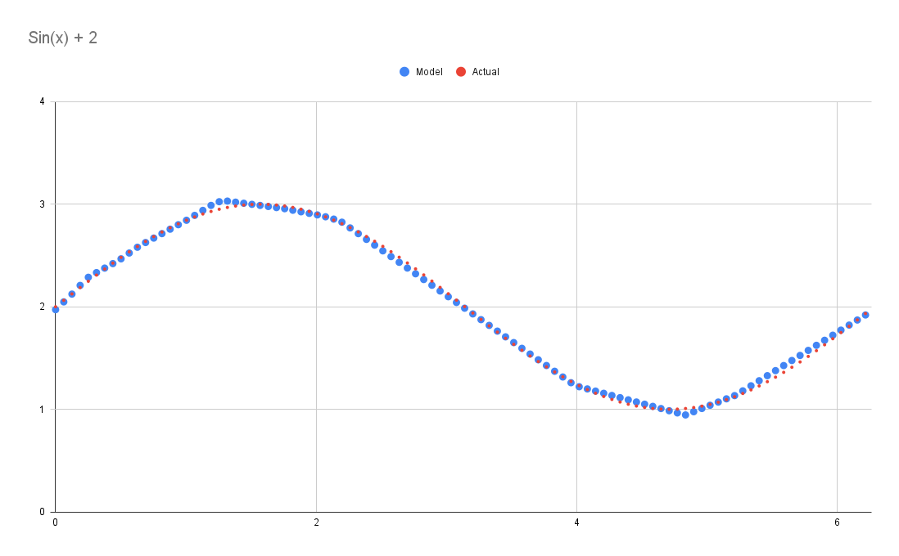

# Neural Network

Neural network from scratch in C++. It is still not very consistent, but it can output decent results sometimes. The model was fit to the function sin(x) + 2 from 0 to 6.28 in the image below.

  

